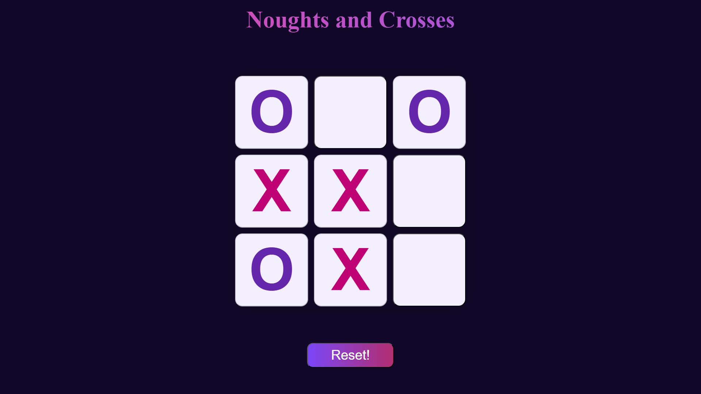

# Noughts and Crosses

A modern, responsive implementation of the classic **Noughts and Crosses (Tic-Tac-Toe)** game built with **HTML, CSS, and JavaScript**.  
This project emphasizes clean game logic, refined UI styling, and responsive design across devices.

---

## Features

- Classic Noughts and Crosses gameplay
- Clean, minimal, and modern user interface
- Fully responsive layout for various screen sizes
- Game reset functionality
- Optimized and maintainable code structure

---

## Tech Stack

- **HTML5** – Markup and structure
- **CSS3** – Styling, gradients, and responsiveness
- **JavaScript (Vanilla)** – Game logic and interactivity

---

## Responsive Design

The application is designed to adapt seamlessly to different screen sizes, ensuring a consistent and user-friendly experience on:

- Mobile devices
- Tablets
- Desktop screens

---

## Preview

---

## Author

**Yashkamal**
